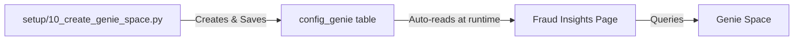

# How to Enable Genie AI Features

The **Fraud Insights** page includes Genie AI for natural language queries. Setup is **fully automated** - no manual configuration needed!

## ✨ Automatic Setup (Recommended)

### **Step 1: Run the Genie Creation Notebook**

```bash
# In Databricks, run:
setup/10_create_genie_space.py
```

This notebook will:
1. ✅ Create a Genie Space
2. ✅ Configure it to query your fraud data
3. ✅ **Automatically save the Space ID** to `config_genie` table

### **Step 2: Refresh the App**

That's it! Just refresh the **Fraud Insights** page:
- The app automatically reads the Genie Space ID from the database
- No config file updates needed
- No redeployment needed

### **How It Works**



The app uses a **fallback chain**:
1. Check environment variable `GENIE_SPACE_ID` (manual override)
2. Check config table `{catalog}.{schema}.config_genie` (automatic)
3. Show helpful message if neither found

---

## 🔧 Manual Override (Optional)

If you want to manually specify a Genie Space ID (e.g., for testing):

### Add to config.yaml:
```yaml
environments:
  dev:
    ...
    genie_space_id: "01f0d3b893281964829ca73bcfa4d7c7"  # Optional override
```

### Regenerate and redeploy:
```bash
python generate_app_yaml.py dev
./deploy_app_source.sh dev
```

---

## 📋 Verification

### Check if Genie Space Exists:

**SQL Query:**
```sql
SELECT config_value 
FROM fraud_detection_dev.claims_analysis.config_genie
WHERE config_key = 'genie_space_id'
```

**Expected Result:**
```
config_value
01f0d3b893281964829ca73bcfa4d7c7
```

### Check in UI:

Go to **Fraud Insights** page:
- ✅ **Success:** "Ask Questions with Genie AI" section with question dropdown
- ⚠️ **Pending:** Info message: "Genie AI features will be enabled after setup..."

---

## 🎯 What Genie Can Do

Once enabled, you can ask natural language questions like:

### Sample Questions (Pre-loaded)
- "Show me the top 10 claims with highest fraud probability"
- "What are the most expensive fraudulent claims?"
- "Compare fraud rates across different claim types"
- "Show all claims flagged as phantom billing"
- "What is the average claim amount for fraudulent vs legitimate?"

### Custom Questions
- "Which providers have the most fraud cases this month?"
- "Show claims with unusual patterns in the last 7 days"
- "What are the top 5 fraud indicators?"

Genie will:
1. 🧠 Understand your question
2. 🔍 Generate SQL query automatically
3. 📊 Return results as a table
4. 📈 Offer to visualize as charts

---

## 🐛 Troubleshooting

### "Genie AI features will be enabled after setup"

**Cause:** Genie Space not created yet
**Fix:** Run `setup/10_create_genie_space.py`

### "Space not found" or API errors

**Cause:** Genie Space was deleted
**Fix:** Run `setup/10_create_genie_space.py` again (it will recreate)

### Config table doesn't exist

**Cause:** Setup notebooks not run in order
**Fix:** Run notebooks in sequence: 01 → 10

---

## 🚀 Full Deployment Workflow

```bash
# 1. Initial deployment (Genie not required)
./deploy_with_config.sh dev

# App is live! All pages work except Genie queries

# 2. Run setup notebooks (in Databricks)
# setup/01_create_catalog_schema.py
# setup/02_generate_claims.py
# ... (continue through setup notebooks)
# setup/10_create_genie_space.py  ← This enables Genie

# 3. Refresh app - Genie works automatically!
# No redeployment needed - app reads from database
```

---

## 💡 Key Benefits of Automatic Approach

✅ **Zero Configuration** - No manual config file updates
✅ **No Redeployment** - Just refresh the page
✅ **Environment-Aware** - Works across dev/staging/prod automatically
✅ **Audit Trail** - Genie Space ID stored in governed Delta table
✅ **Idempotent** - Re-running setup notebook updates cleanly

---

## 🔍 Technical Details

### Where is the Genie Space ID Stored?

**Table:** `{catalog}.{schema}.config_genie`

**Schema:**
```sql
CREATE TABLE config_genie (
  config_key STRING PRIMARY KEY,
  config_value STRING,
  updated_at TIMESTAMP
)
```

**Lookup Code** (in `app/pages/3_fraud_insights.py`):
```python
@st.cache_data(ttl=3600)  # Cache for 1 hour
def get_genie_space_id_from_config():
    query = f"""
    SELECT config_value 
    FROM {CONFIG_TABLE}
    WHERE config_key = 'genie_space_id'
    """
    result = execute_sql_query(query)
    return result.iloc[0]['config_value'] if result else ""
```

### Fallback Chain:
1. `os.getenv("GENIE_SPACE_ID")` - Manual override
2. `get_genie_space_id_from_config()` - Automatic database lookup
3. Show info message - Graceful degradation

---

## 📚 Related Files

- **Setup:** `setup/10_create_genie_space.py` - Creates space and saves ID
- **Config Table:** `{catalog}.{schema}.config_genie` - Stores ID
- **App Code:** `app/pages/3_fraud_insights.py` - Reads ID at runtime
- **Optional Override:** `config.yaml` → `genie_space_id` field

