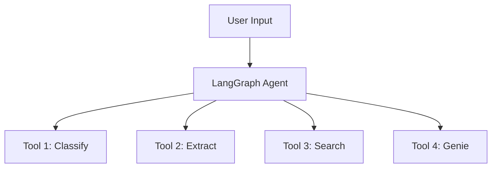

# 🖼️ Notebook Images Setup Guide

This folder contains images used in the `notebooks/01_fraud_agent.py` educational notebook.

## 📂 Required Images

Place these images in this directory for the notebook to display them correctly:

1. **technical_architecture_5layers.png** - 5-layer architecture diagram
2. **4_tools_architecture.png** - Four tools overview diagram
3. **flowchart_showing_react_claim.png** - ReAct pattern flowchart

## ✅ Where Images Work

### GitHub ✅
- Images stored in this folder work automatically on GitHub
- Relative paths: `../docs/images/filename.png`
- Displays in: README.md, notebooks when viewed on GitHub

### Local Development ✅
- Images work when viewing notebooks locally
- No additional setup needed

### Databricks Workspace (Requires Setup)
Images **may not display** in Databricks notebooks by default. Two options:

#### Option A: Upload to Databricks Workspace (Recommended)

```bash
# Upload images to your workspace
databricks workspace import-dir docs/images /Workspace/Shared/fraud_detection/images --overwrite
```

Then images will work for all users in your workspace.

#### Option B: Upload to Unity Catalog Volume

```bash
# Create volume for images (one-time)
databricks fs mkdirs dbfs:/Volumes/<catalog>/<schema>/images/

# Upload images
databricks fs cp docs/images/*.png dbfs:/Volumes/<catalog>/<schema>/images/ --recursive
```

Update notebook image paths to:
```markdown

```

## 🎨 Creating/Getting Images

### Option 1: Download from Databricks
If images already exist in your Databricks workspace:

```bash
# Download from workspace
databricks workspace export /Workspace/Users/your.name@company.com/fraud_detection/images/technical_architecture_5layers.png \
  docs/images/technical_architecture_5layers.png
```

### Option 2: Create New Images
Generate diagrams using:
- **Draw.io / Diagrams.net** (free, recommended)
- **Lucidchart**
- **Mermaid** (code-based diagrams)
- **Excalidraw** (hand-drawn style)

### Option 3: Use Placeholders
For testing, create placeholder images:

```bash
# Create placeholder
echo "Architecture Diagram Placeholder" > docs/images/technical_architecture_5layers.txt
```

## 📝 Best Practices

1. **Store in repo** - Commit images to git for version control
2. **Use relative paths** - Makes notebooks portable across environments
3. **Optimize size** - Keep images under 1MB for fast loading
4. **Use descriptive names** - Clear file names help maintainability
5. **Document updates** - Note when diagrams change in git commits

## 🔧 Troubleshooting

### Images Don't Display in GitHub
- ✅ Check file exists in `docs/images/`
- ✅ Check path is relative: `../docs/images/filename.png`
- ✅ Check file extension matches (case-sensitive)

### Images Don't Display in Databricks
- ✅ Upload images to workspace (see Option A above)
- ✅ Or update paths to absolute Databricks paths
- ✅ Or use Unity Catalog Volumes (Option B)

### Images Too Large
```bash
# Optimize PNG images (requires imagemagick)
brew install imagemagick
mogrify -resize 1200x -quality 85 docs/images/*.png
```

## 📚 Alternative: Text-Based Diagrams

For simple diagrams, consider using **Mermaid** syntax in markdown:



Mermaid diagrams:
- ✅ Work on GitHub automatically
- ✅ Version-controlled (text-based)
- ✅ No file uploads needed
- ❌ Don't work in Databricks notebooks (yet)

## 🆘 Need Help?

- **Can't find original images?** Recreate from architecture docs
- **Images too large?** Use online tools like TinyPNG
- **Need diagram tools?** Try draw.io (free, web-based)

